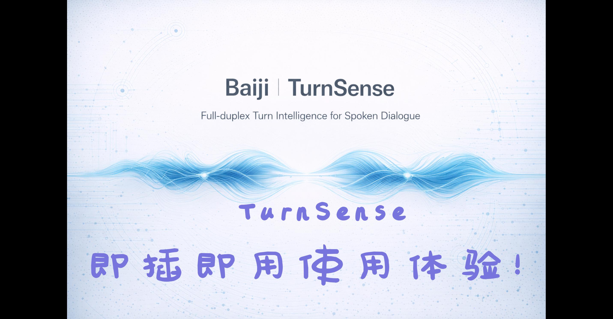

<div align="center">


<br/>

# TurnSense

### 🎯 Lightweight · Accurate · Three-Class — Redefining Speech Turn Detection

<br/>

<center><strong>47M 参数 ｜ CPU 延迟 ~55ms ｜ F1 高达 96.35% ｜ 无效语义过滤</strong></center>


<br/>

[](https://github.com/Bairong-Xdynamics/TurnSense)
[](https://huggingface.co/brgroup/TurnSense)
[](./LICENSE)
[](https://github.com/Bairong-Xdynamics/TurnSense)

</div>

<br/>

**Language**: **English** | [中文](./README.md)

<br/>

> **⭐ If TurnSense is useful to you, please give us a Star!** It helps us keep improving the model and documentation.

<br/>

## 📖 Table of Contents

- [Why TurnSense](#-why-turnsense)
- [Overview](#-overview)
- [Key Features](#-key-features)
- [Model Size Comparison](#-model-size-comparison)
- [Benchmark Results](#-benchmark-results)
- [Quick Start](#-quick-start)
- [Evaluation Guide](#-evaluation-guide)
- [Citation](#-citation)
- [Contact & Community](#-contact--community)
- [License](#-license)

<br/>

---

<br/>

## 🏆 Why TurnSense

<div align="center">

| Dimension | TurnSense Performance |
| :---: | :---: |
| 🎯 **Accuracy** | F1 **96.35%** (easyturn_real_test_ZH) — best in class |
| ⚡ **Inference Latency** | CPU p50 ≈ **54.65ms** — real-time interaction ready |
| 📦 **Model Size** | Only **47M** parameters, INT8 version only **~50MB** |
| 🧠 **Classification** | First open-source model natively supporting **complete / incomplete / invalid** three-class detection |
| 🚫 **Invalid Filtering** | Invalid utterance F1 reaches **94.34%**, effectively suppressing noise-triggered responses |
| 🤗 **Open-Source Friendly** | FP32 / INT8 ONNX provided, ready to use out of the box |

</div>

<br/>

---

<br/>

## 📌 Overview

**TurnSense** is a **three-class semantic detection model** designed for human-machine voice interaction, focused on solving a critical problem in dialogue systems:

> **During a user's speech, should the system respond immediately, or continue waiting?**

Traditional approaches typically rely on a simple binary classification — "finished or not." **TurnSense goes further** by simultaneously modeling semantic completeness and invalid input detection, enabling more natural turn-taking in complex real-world scenarios and **significantly reducing false interruptions, premature responses, and noise-triggered activations**.

<div align="center">
  
</div>

## 🎬 Demo Video

<p align="center">
  <a href="https://huggingface.co/brgroup/TurnSense/blob/main/image/PR_new.mp4">
    
  </a>
</p>

TurnSense classifies user input into three semantic states:

| State | Description | Example |
| :---: | :--- | :--- |
| ✅ **Complete** | The user has expressed a complete intent; the system can respond | `"Check tomorrow's weather in Shanghai for me."` |
| ⏳ **Incomplete** | The user's expression is unfinished — truncated, paused, or trailing off | `"I'd like to ask about that order from yesterday..."` |
| 🔇 **Invalid** | The input does not constitute meaningful speech and should not trigger a response | `"...(continuous noise / non-verbal vocalization)"` |

These three labels enable the system to determine not only **"should I respond?"** but also **"is it worth responding to?"** — significantly improving interaction naturalness and system stability in voice assistants, real-time calls, intelligent customer service, and more.

<br/>

---

<br/>

## ✨ Key Features

### 🧠 Semantic-Level Three-Class Detection

Simultaneously models `complete / incomplete / invalid` states — closer to real conversational behavior than traditional binary classification, and currently the **only open-source solution with native invalid utterance detection**.

### ⚡ Ultra-Lightweight, Ultra-Fast Inference

Only **47M** parameters (INT8 version ~50MB). CPU inference latency: p50 ≈ **54.65ms**, p90 ≈ **58.00ms** — meets the strict requirements of real-time interaction **without a GPU**.

### 🎯 Leading Accuracy

Achieves **F1 96.35%** (complete) and **F1 96.32%** (incomplete) on easyturn_real_test_ZH (300 samples), and **F1 92.30%** (complete) and **F1 91.62%** (incomplete) on semantic_test_ZH (2000 samples) — best or runner-up among all comparable models.

### 🚫 Invalid Input Filtering

On the NonverbalVocalization test set, invalid utterance precision reaches **100%** with recall of **90.37%** (F1 = 94.34%), effectively suppressing false triggers from non-verbal sounds and noise.

### ⚖️ More Robust Turn Decisions

Balances precision and recall in semantically ambiguous, pause-heavy, or colloquial scenarios, reducing both premature responses and missed responses.

### 📊 Reproducible Evaluation Framework

Ships with a complete evaluation pipeline and scripts, supporting unified metric comparison and performance regression analysis for full reproducibility.

### 🤗 Open-Source Friendly, Plug-and-Play

Standardized repository structure with FP32 / INT8 ONNX models — from installation to inference in just a few minutes.

<br/>

---

<br/>

## 📐 Model Size Comparison

<div align="center">

| Model | Parameters | Three-Class | Link |
| :--- | :---: | :---: | :--- |
| TEN-Turn | **7B** | ❌ | [TEN-framework/TEN_Turn_Detection](https://huggingface.co/TEN-framework/TEN_Turn_Detection) |
| Easy-Turn | 850M | ❌ | [ASLP-lab/Easy-Turn](https://huggingface.co/ASLP-lab/Easy-Turn) |
| NAMO-Turn-Detector (ZH) | 66M | ❌ | [videosdk-live/Namo-Turn-Detector-v1-Multilingual](https://huggingface.co/videosdk-live/Namo-Turn-Detector-v1-Multilingual) |
| **⭐ TurnSense** | **47M** | **✅** | [**Baiji-Team/TurnSense**](https://huggingface.co/brgroup/TurnSense) |
| Smart-Turn-v3 | 8M | ❌ | [pipecat-ai/smart-turn-v3](https://huggingface.co/pipecat-ai/smart-turn-v3) |
| FireRedChat-turn-detector | -- | ❌ | [FireRedTeam/FireRedChat-turn-detector](https://huggingface.co/FireRedTeam/FireRedChat-turn-detector) |

</div>

> 💡 With only **47M** parameters, TurnSense achieves three-class capability — the best balance between accuracy and model size.

<br/>

---

<br/>

## 📊 Benchmark Results

> All results below are based on open-source Chinese evaluation sets. Latency marked with `(GPU)` indicates GPU environment; otherwise, latency was measured on **CPU**.

<br/>

### 📋 easyturn_real_test_ZH (300 samples)

> Data source: Real data samples from [Easy-Turn-Testset](https://huggingface.co/datasets/ASLP-lab/Easy-Turn-Testset)

| Model | P (complete) | R (complete) | **F1 (complete)** | P (incomplete) | R (incomplete) | **F1 (incomplete)** | p50 Latency | p90 Latency |
| :--- | :---: | :---: | :---: | :---: | :---: | :---: | :---: | :---: |
| Easy-Turn | 97.26% | 94.67% | 95.95% | 94.81% | 97.33% | 96.05% | 183.87 (GPU) | 300.37 (GPU) |
| Smart-Turn-v3 | 64.97% | 76.67% | 70.34% | 71.54% | 58.67% | 64.47% | 36.84 | 39.10 |
| TEN-Turn | **99.25%** | 88.00% | 93.29% | 89.22% | **99.33%** | 94.01% | 17.66 (GPU) | 19.41 (GPU) |
| FireRedChat | 70.65% | 94.67% | 80.91% | 91.92% | 60.67% | 73.09% | 98.30 | 99.42 |
| NAMO-Turn | 81.53% | 85.33% | 83.39% | 84.62% | 80.67% | 82.59% | 3.60 | 83.44 |
| **⭐ TurnSense** | 96.03% | **96.67%** | **🏆 96.35%** | **96.64%** | 96.00% | **🏆 96.32%** | 54.65 | 58.00 |

> **🔍 Key Finding:** TurnSense achieves the **highest F1** on both complete and incomplete classes, and is the only model with CPU p50 < 60ms while maintaining F1 > 96%.

<br/>

### 📋 semantic_test_ZH (2000 samples)

> Data source: Chinese test split from [KE-Team/SemanticVAD-Dataset](https://huggingface.co/datasets/KE-Team/SemanticVAD-Dataset)

| Model | P (complete) | R (complete) | **F1 (complete)** | P (incomplete) | R (incomplete) | **F1 (incomplete)** | p50 Latency | p90 Latency |
| :--- | :---: | :---: | :---: | :---: | :---: | :---: | :---: | :---: |
| Easy-Turn | 78.14% | 98.30% | 87.07% | 97.64% | 70.30% | 81.74% | 183.87 (GPU) | 300.37 (GPU) |
| Smart-Turn-v3 | 59.25% | 88.10% | 70.85% | 76.80% | 39.40% | 52.08% | 36.84 | 39.10 |
| TEN-Turn | 85.25% | **99.60%** | 91.87% | **99.52%** | 82.70% | 90.33% | 17.66 (GPU) | 19.41 (GPU) |
| FireRedChat | 66.76% | 99.40% | 79.87% | 98.83% | 50.50% | 66.84% | 98.30 | 99.42 |
| NAMO-Turn | 71.48% | 86.70% | 78.36% | 83.10% | 65.40% | 73.20% | 3.60 | 83.44 |
| **⭐ TurnSense** | **88.96%** | 95.90% | **🏆 92.30%** | 95.55% | **88.00%** | **🏆 91.62%** | 54.65 | 58.00 |

> **🔍 Key Finding:** On the larger 2000-sample test set, TurnSense still maintains the best F1, demonstrating strong generalization capability.

<br/>

### 📋 NonverbalVocalization_invalid (728 samples)

> Data source: OpenSLR [Deeply Nonverbal Vocalization Dataset (SLR99)](https://openslr.elda.org/99/)

| Model | P (invalid) | R (invalid) | **F1 (invalid)** |
| :--- | :---: | :---: | :---: |
| **⭐ TurnSense** | **100.00%** | **90.37%** | **🏆 94.34%** |

> **🔍 Key Finding:** TurnSense is currently the only model that supports invalid utterance detection. A precision of **100%** means zero false positives — effectively preventing noise from triggering system responses.

<br/>

---

<br/>

## 🚀 Quick Start

### 1. Installation

```bash
git clone https://github.com/Bairong-Xdynamics/TurnSense.git
cd TurnSense

pip install -U numpy onnxruntime torch librosa soundfile pandas scikit-learn huggingface_hub
```

### 2. Model Weights

TurnSense model weights are available on Hugging Face: [Baiji-Team/TurnSense](https://huggingface.co/brgroup/TurnSense)

| Version | Size | Use Case |
| :--- | :--- | :--- |
| FP32 | ~191 MB | Accuracy-first |
| INT8 | ~50 MB | Deployment-first (recommended) |

**Download Options:**

**Option 1: Auto-download (Recommended)**
The inference script includes built-in Hugging Face download logic. The model will be automatically fetched and cached on first run.

**Option 2: Git LFS**

```bash
git lfs install
git clone https://huggingface.co/brgroup/TurnSense
```

**Option 3: Hugging Face Hub**

```python
from huggingface_hub import snapshot_download
snapshot_download(repo_id="brgroup/TurnSense")
```

### 3. Inference

```bash
python infer.py
```

Example output:

```
Loading model from brgroup/TurnSense...
Running inference on: "我想问一下那个订单就是昨天..."

Results:
  Input: "我想问一下那个订单就是昨天..."
  TurnSense Detection Result: "incomplete"
```

<br/>

---

<br/>

## 🧪 Evaluation Guide

### 1) Evaluation Pipeline

1. Load the `.jsonl` test dataset (line-by-line JSONL)
2. Warm up each model (default `warmup_iters=20`)
3. Run per-sample inference, collecting classification and performance metrics
4. Automatically generate summary and detail files

Output files include:

| File | Description |
| :--- | :--- |
| `report.md` | Summary evaluation report |
| `results.json` | Structured evaluation results |
| `config.json` | Evaluation configuration |
| `per_sample__*.jsonl` | Per-sample prediction details |

### 2) Data Format (JSONL)

Each line is a JSON object containing at least the following fields:

| Field | Description |
| :--- | :--- |
| `audio_path` | Path to the audio file |
| `text` | Text content |
| `label` | Label (`complete` / `incomplete` / `invalid`) |

Example:

```jsonl
{"audio_path":"/001.wav","text":"帮我查一下明天上海天气","label":"complete"}
{"audio_path":"/002.wav","text":"我想问一下那个订单就是昨天...","label":"incomplete"}
{"audio_path":"/003.wav","text":"啊…嗯…（持续噪声）","label":"invalid"}
```

### 3) Run Evaluation

```bash
python TurnSense/Turn_benchmark/benchmark.py
```

<br/>

---

<br/>

## 📚 Citation

If you use TurnSense in your research or product, please cite:

```bibtex
@misc{turnsense2026,
  author       = {Baiji Team},
  title        = {TurnSense: A Three-Class Semantic Detection Model for Complete, Incomplete, and Invalid Utterances},
  year         = {2026},
  publisher    = {Hugging Face},
  howpublished = {\url{https://huggingface.co/brgroup/TurnSense}},
}
```

<br/>

## ❓ Contact & Community

If you have questions or suggestions, feel free to reach out:

| Channel | Contact |
| :--- | :--- |
| 📧 Email | [huan.shen@brgroup.com](mailto:huan.shen@brgroup.com) · [yingao.wang@brgroup.com](mailto:yingao.wang@brgroup.com) · [wei.zou@brgroup.com](mailto:wei.zou@brgroup.com) |
| 💬 WeChat | h2538406363 |
| 👥 WeChat Group | Scan the QR code to join the group<br> |
| 🐛 Issues | [GitHub Issues](https://github.com/Bairong-Xdynamics/TurnSense/issues) |
| 🔀 PR | [Pull Requests](https://github.com/Bairong-Xdynamics/TurnSense/pulls) |

<br/>

## 📄 License

This project is released under the **Apache License 2.0** with certain additional conditions. See [LICENSE](./LICENSE) for details.

<br/>

---

<div align="center">

**Built with ❤️ by [Baiji Team](https://github.com/Bairong-Xdynamics)**

</div>
